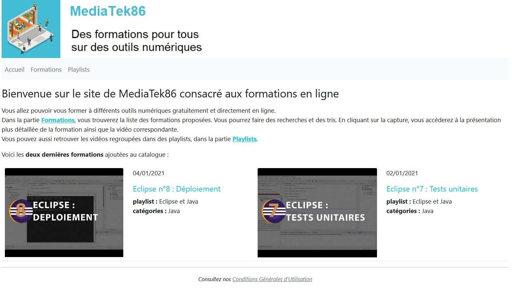
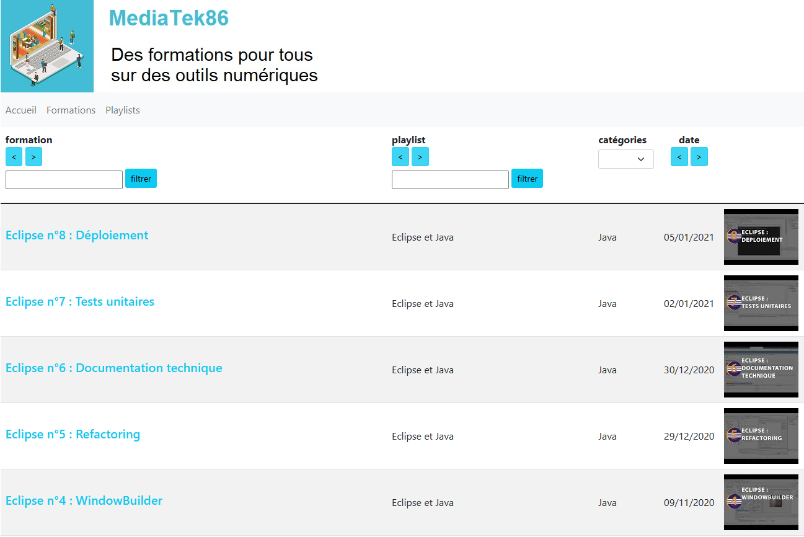
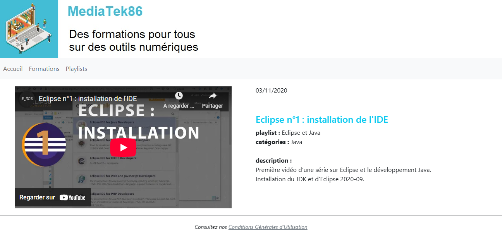
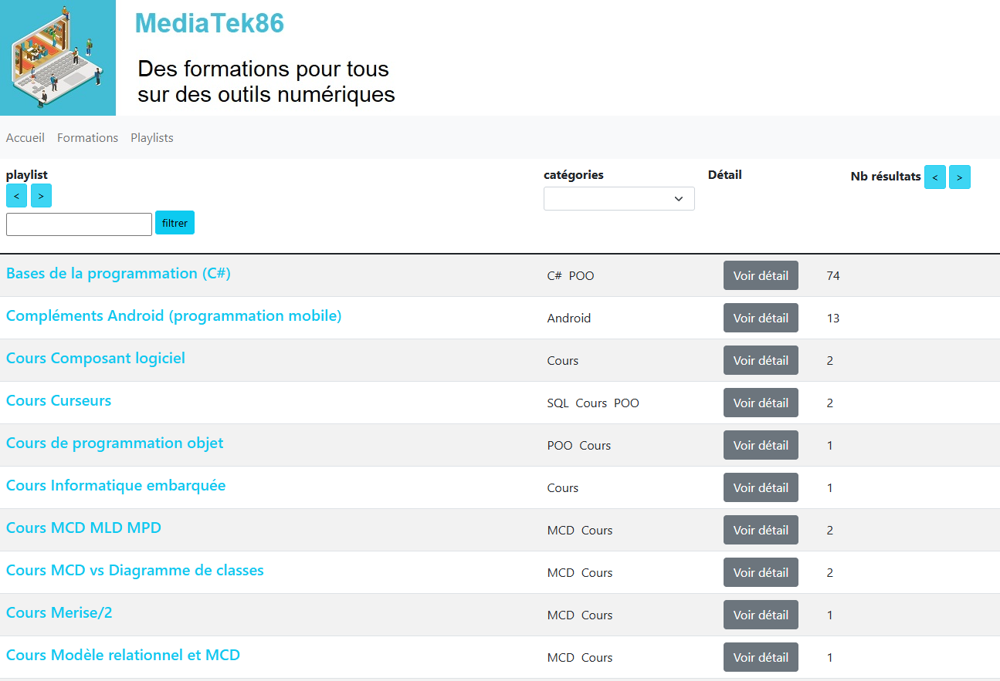
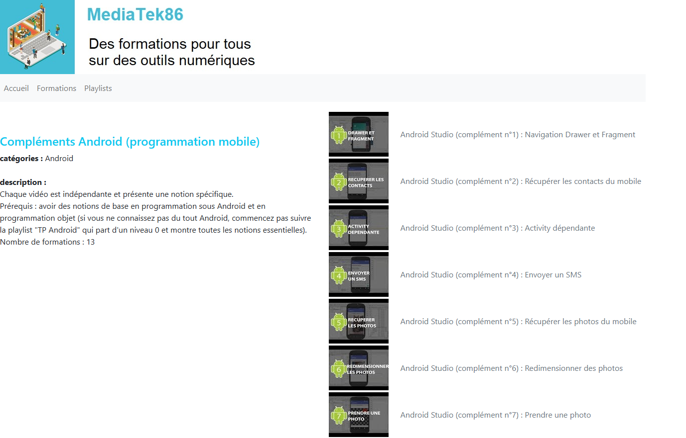
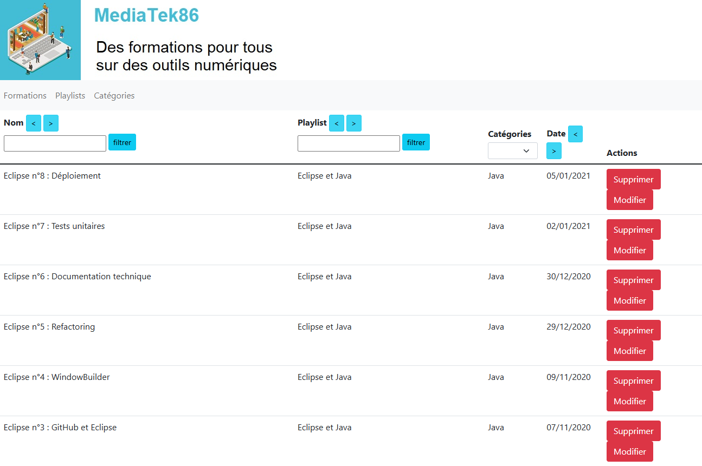
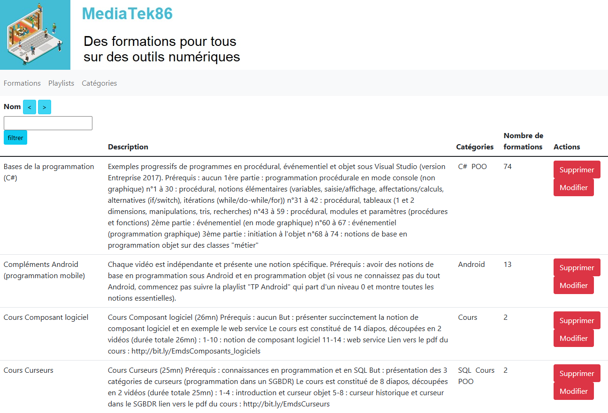
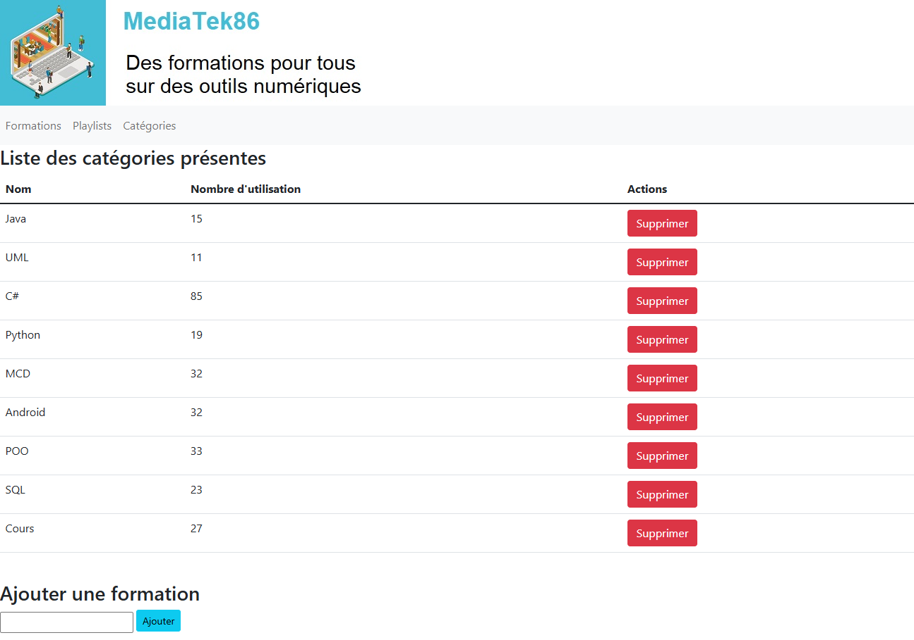

# MediatekFormation
## Readme original
Voici le lien du repository original : https://github.com/CNED-SLAM/mediatekformation
## Présentation
Ce site, développé avec Symfony 6.4, permet d'accéder aux vidéos d'auto-formation proposées par une chaîne de médiathèques et qui sont aussi accessibles sur YouTube.
Le site est complet avec tous les tris et filtres fonctionnels de façon à faciliter la navigation sur le site par tous les utilisateurs.

## Les différentes pages : 
### Accueil

Cette page permet d'accéder aux autres pages accessibles au public ainsi que d'afficher les 2 dernières formations ajoutées.

### Formations :

Cette page permet d'accéder à la liste de toutes les formations disponibles. Celles-ci peuvent être triées par :
- Ordre alphabétique/anti alphabétique sur le nom;
- Recherche directe sur le nom;
- Ordre alphabétique/anti alphabétique sur la playlist;
- Recherche directe sur la playlist;
- Catégorie;
- Ordre chronologique/anti chronologique sur la date.

Le clic sur la miniature permet d'accéder à la page de la formation concernée.

### Détail d'une formation :

Cette page n'est accessible qu'après le clic sur la miniature d'une formation, elle permet de voir toutes les informations liées à cette formation ainsi que de visionner celle-ci via un embed Youtube.

### Playlists

Cette page permet de voir toutes les playlists disponibles. Elles peuvent être triées par :
- Odre alphabétique/anti alphabétique sur le nom;
- Recheche directe sur le nom;
- Catégories;
- Nombre de formations;
Le clic sur le bouton "Voir détail" permet d'accéder à la page de cette playlist.

### Détail d'une playlist :

Cette page permet de voir le détail d'une playlist sélectionnée, elle montre les formations contenues, les catégories de cette playlist ainsi que sa description.

### Admin formations

Cette page est la première page à accès restreint de l'application, elle permet de gérer les formations, on peut créer, supprimer et modifier une formation depuis cette page.
Les mêmes tris et filtres sont disponibles que dans la page formations accessible au public.

### Admin playlists :

Cette page permet de créer, supprimer et modifier des playlists. Les mêmes tris et filtres sont disponibles que pour la page accessible au public.

### Admin catégories :

Cette page permet de créer et supprimer des catégories.